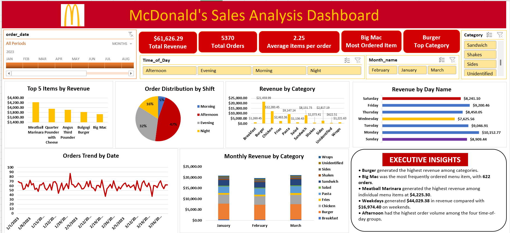

# McDonald's Sales Analysis — Excel Dashboard

An interactive sales analysis project built in Excel to explore revenue performance, menu-item popularity, order behavior, and time-based sales trends.

## 📊 Project Overview

This project analyzes McDonald's order-level sales data and transforms transaction records into an interactive Excel dashboard.

The analysis focuses on:

- Revenue and category performance
- Daily order volume
- Menu-item popularity
- Revenue by menu item
- Monthly category trends
- Average items per order
- Time-of-day ordering patterns
- Weekday vs. weekend performance
- Top 5 menu items by revenue

The goal was to move from raw transaction data to a clean, explorable analysis that answers concrete business questions.

---

## 🎯 Business Questions

The dashboard was designed to answer 10 key questions:

1. What is the total sales revenue for each category?
2. How many orders are placed each day?
3. Which menu item is ordered most frequently?
4. What is the total revenue generated by each menu item?
5. How does category revenue change over months?
6. What is the average number of items per order?
7. How does order volume vary by time of day?
8. How do sales trends differ between weekdays and weekends?
9. How does category sales performance vary across months?
10. Which are the top 5 menu items by revenue?

---

## 📁 Dataset

The project uses two source tables:

### Menu Master

- 32 menu items
- `menu_item_id`
- `item_name`
- `category`
- `price`

### Orders Data

- 12,234 transaction-detail rows
- 5,370 unique orders
- Date range: January 1, 2023 – March 9, 2023
- `order_details_id`
- `order_id`
- `order_date`
- `order_time`
- `item_id`

The two datasets were connected using:

`Orders[item_id] → Menu_Master[menu_item_id]`

A Left Outer Join was used so that all transaction-detail records were retained.

---

## 🧹 Data Cleaning & Preparation

Before analysis, the data was checked for duplicates, missing values, and data consistency.

### Data quality checks

- No duplicate rows were found in either source table.
- No duplicate `menu_item_id` values were found in the Menu Master.
- No duplicate `order_details_id` values were found in the Orders data.
- The Menu Master contained no null values.
- 137 transactions contained missing `item_id` values.

### Handling missing item IDs

Forward/backward filling was evaluated for the 137 missing `item_id` values.

However, `item_id` is a categorical transaction identifier. Filling the missing values would assign products without sufficient evidence and could distort item-level and category-level analysis.

Therefore, these transactions were retained as unidentified records rather than assigning unsupported products.

A `Category_Display` field was used to represent these records as **Unidentified** in the analysis.

---

## 🔄 Data Transformation

Additional fields were created in Power Query to support the analysis:

- Revenue
- Month Name
- Month Number
- Day Name
- Day Number
- Day Type
- Order Hour
- Time of Day

### Time-of-day groups

| Time of Day | Hours |
|---|---|
| Morning | 10–11 |
| Afternoon | 12–16 |
| Evening | 17–19 |
| Night | 20–22 |

The dataset does not contain a quantity column. Each transaction-detail row represents one ordered menu item, so revenue was calculated directly from the item's price.

---

## 📈 Dashboard

The final Excel dashboard includes:

### KPI Cards

- **Total Revenue:** $61,626.29
- **Total Orders:** 5,370
- **Average Items per Order:** 2.25
- **Most Ordered Item:** Big Mac
- **Top Category:** Burger

### Interactive Controls

- Order Date Timeline
- Time of Day slicer
- Month slicer
- Category slicer

### Visualizations

- Top 5 Items by Revenue
- Order Distribution by Shift
- Revenue by Category
- Revenue by Day Name
- Orders Trend by Date
- Monthly Revenue by Category



---

## 🔍 Key Insights

### Category Performance

**Burger** generated the highest revenue among the categories.

### Menu Popularity

**Big Mac** was the most frequently ordered menu item, with **622 orders**.

### Individual Item Revenue

**Meatball Marinara** generated the highest revenue among individual menu items at **$4,225.30**.

### Top 5 Menu Items by Revenue

| Rank | Menu Item | Revenue |
|---|---|---:|
| 1 | Meatball Marinara | $4,225.30 |
| 2 | Quarter Pounder with Cheese | $3,958.57 |
| 3 | Angus Third Pounder | $3,907.11 |
| 4 | Bulgogi Burger | $3,816.12 |
| 5 | Big Mac | $3,725.78 |

The top 5 items generated a combined **$19,632.88**.

### Weekday vs. Weekend

- **Weekday Revenue:** $44,029.38
- **Weekend Revenue:** $16,974.40

### Time of Day

**Afternoon** accounted for the highest order volume among the four time-of-day groups.

### Average Items per Order

The average number of items per order was **2.25**.

---

## 🛠️ Tools & Skills

- Microsoft Excel
- Power Query
- PivotTables
- PivotCharts
- Excel Slicers
- Excel Timeline
- Data Cleaning
- Data Transformation
- Exploratory Data Analysis
- Data Visualization
- Business Question Framing
- Insight Communication

---

## 📂 Project Files

| File | Description |
|---|---|
| `Mcds_Sales_Analysis_dashboard.xlsx` | Complete Excel workbook containing source data, cleaned data, analysis, PivotTables, and interactive dashboard |
| `McDonalds_Sales_Analysis.pdf` | Project presentation explaining the analysis, methodology, dashboard, and insights |
| `dashboard.png` | Preview image of the final dashboard |

---

## 🔄 Project Workflow

```text
Raw Data
    ↓
Data Validation
    ↓
Data Cleaning
    ↓
Power Query Transformations
    ↓
PivotTable Analysis
    ↓
Interactive Dashboard
    ↓
Business Insights

---

##  📌   Scope Note

The findings in this project describe patterns within the provided transaction dataset and should not be interpreted as official McDonald's business results.

---

## 👩‍💻 About

**Divya Bansal**  
Aspiring Data Analyst

This project helped strengthen my understanding of how structured sales data can be transformed into interactive analysis and clear business insights using Excel.
